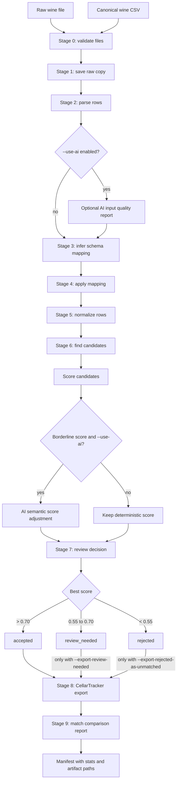

# wine-importer Workflow

This document describes the normal operating workflow for `wine-importer`: what
goes in, what each stage does, what files are written, and how to review the
results before importing into CellarTracker.

## Goal

The pipeline converts a messy wine inventory file into two practical outputs:

- `08_cellartracker_import.csv`: the cleaned CellarTracker import file.
- `09_match_report.csv`: a side-by-side review file showing each input row,
  its best canonical candidate, match score, status, and field differences.

The importer is designed as a decision-support tool. It should make strong
matches easy to accept, weak matches easy to reject, and borderline matches easy
to compare manually.

## Typical Command

```bash
wine-importer run data/raw/wine_raw_test1.csv \
  --canonical data/canonical/wine_canonical_clean.csv \
  --out-dir runs/example
```

With optional AI helpers:

```bash
wine-importer run data/raw/wine_raw_test1.csv \
  --canonical data/canonical/wine_canonical_clean.csv \
  --out-dir runs/example \
  --use-ai
```

Use `--use-ai` when headers are unusual, non-English, or when you want AI
semantic scoring for borderline matches. The deterministic path is the default
and works without an API key.

## Flowchart



## Inputs

The main input is a raw cellar list in one of the supported formats:

- CSV, TSV, TXT, and delimiter-separated text files.
- XLSX, XLS, and XLSM spreadsheets.
- JSON files readable by pandas.
- Unknown text-like files when `--use-ai` is enabled.

The canonical input is a CSV of known wines. The loader supports both simple
canonical files and CellarTracker-style split fields such as `UserWine1`,
`UserWine2`, and `BottleSize`.

## Stage-by-stage Behavior

### Stage 0: Validate Files

The pipeline checks that the input file and canonical file exist and are not
empty. The canonical file is loaded once to ensure it contains valid wine
records. Obvious column-shift corruption is rejected early, for example when a
producer field looks like a year or bottle size, a varietal looks like a bottle
size, an appellation looks like a quantity, or a country looks like a wine name.

Artifact: none.

### Stage 1: Raw Copy

The input file is read with the same parser that will be used for processing,
then written back out as a CSV copy. This gives a stable snapshot of what the
pipeline saw at runtime.

Artifact:

```text
01_raw_copy.csv
```

### Stage 2: Parse Rows

The parser converts the input file into `RawRow` records. Each row has:

- source file name
- row number
- original field/value mapping

Delimiter detection handles comma, semicolon, tab, and pipe-separated files.
Excel files are read through pandas and openpyxl.

Artifact:

```text
02_parsed_rows.json
```

### Optional AI Input Quality Report

When `--use-ai` is enabled, the first few parsed rows are sent to the AI quality
checker. This does not block the pipeline. If the API is unavailable, the
artifact records the error and processing continues.

Artifact:

```text
02_input_quality.json
```

### Stage 3: Infer Schema Mapping

The schema mapper converts raw headers into internal fields such as:

- `producer`
- `name`
- `vintage`
- `country`
- `region`
- `appellation`
- `varietal`
- `quantity`
- `size`
- `location`
- `bin`
- `notes`

The deterministic mapper uses header aliases and normalized header matching.
Examples: `Winery` maps to `producer`, `Wine Label` maps to `name`, `Qty` maps
to `quantity`, and `BottleSize` maps to `size`.

If `--use-ai` is enabled and deterministic mapping is weak, AI schema mapping is
used as a fallback.

Artifact:

```text
03_mapping.yaml
```

### Stage 4: Apply Schema Mapping

Raw rows are projected into the internal `MappedWineRow` model. This separates
the original input shape from the normalized wine fields the rest of the
pipeline expects.

Artifact:

```text
04_mapped_rows.json
```

### Stage 5: Normalize Rows

Normalization creates comparison-friendly values while preserving the original
mapped values. It handles:

- lowercasing and accent stripping
- abbreviation expansion such as `cab-sauv` to `cabernet sauvignon`
- vintage normalization such as `NV`
- bottle size normalization such as `750 ml` and `magnum`

Rows with no meaningful wine fields are filtered out.

Artifact:

```text
05_normalized_rows.json
```

### Stage 6: Find and Score Candidates

The canonical wine file is loaded into `CanonicalWine` records. Search then
builds a cached token index and finds likely candidates for each normalized row.

Candidate retrieval uses:

- producer-ish matching
- appellation-ish matching
- strong name token overlap
- approximate token weighting when there is meaningful identity overlap
- vintage and country signals where available

The scorer ranks candidates with weighted RapidFuzz similarity across producer,
name, appellation, vintage, varietal, and region. Country or vintage conflicts
can reduce the score. Candidate artifacts include score breakdowns,
`blocking_reason`, top-score margin, and candidate counts.

When `--use-ai` is enabled, scores in the shared borderline policy window
`0.55` to `0.70` can be semantically adjusted by AI.

Artifact:

```text
06_candidate_matches.json
```

### Stage 7: Review Decision

Each row gets one best match and one status.

Decision policy:

```text
accept_threshold = 0.70
review_threshold = 0.55

score > accept_threshold                         accepted
review_threshold <= score <= accept_threshold    review_needed
score < review_threshold                         rejected
```

This stage is automatic. Manual review happens by inspecting the output files,
especially `09_match_report.csv`.

Artifact:

```text
07_reviewed_matches.json
```

### Stage 8: CellarTracker Export

The exporter writes a CellarTracker-shaped CSV. By default, it exports only
`accepted` rows and uses canonical identity fields from the best match while
preserving user inventory fields such as:

- quantity
- bottle size
- location
- bin
- original notes

Conservative export is the default:

```text
accepted       -> exported with canonical match
review_needed  -> skipped unless --export-review-needed is set
rejected       -> skipped unless --export-rejected-as-unmatched is set
```

Rejected rows exported with `--export-rejected-as-unmatched` use only the
user/internal row fields and do not include a canonical id.

Artifact:

```text
08_cellartracker_import.csv
```

### Stage 9: Match Comparison Report

The report writer creates a spreadsheet-friendly comparison file. This is the
best file for human review.

It includes:

- row number
- status
- score
- top score, second score, and score margin
- candidate count and blocking reason
- producer, name, vintage, and region component scores
- hard conflicts
- suggested action
- reason
- input item summary
- best candidate summary
- canonical id
- side-by-side input and candidate fields
- `diff_fields`, which lists fields that differ after normalization

Artifact:

```text
09_match_report.csv
```

## Reviewing Results

Open the report:

```bash
open runs/example/09_match_report.csv
```

Or regenerate and preview it in the terminal:

```bash
wine-importer report runs/example/07_reviewed_matches.json \
  --out runs/example/09_match_report.csv
```

Filter by status:

```bash
wine-importer report runs/example/07_reviewed_matches.json --status rejected
wine-importer report runs/example/07_reviewed_matches.json --status review_needed
wine-importer report runs/example/07_reviewed_matches.json --status accepted
```

Suggested review order:

1. Review `rejected` rows first to check whether no candidate was found or the
   wrong candidate was chosen.
2. Review `review_needed` rows next, focusing on score, best candidate, and
   `diff_fields`.
3. Spot-check `accepted` rows, especially when `diff_fields` contains vintage,
   country, producer, or name.
4. Import `08_cellartracker_import.csv` only after resolving rows that should
   not be accepted automatically.

## Run Manifest

Every run writes:

```text
run_manifest.yaml
```

The manifest records:

- input path
- canonical path
- final export path
- all artifact paths
- row counts
- accepted, review-needed, and rejected counts
- active score thresholds

Use it as the run audit trail.

## Manual Stage Commands

The full pipeline is normally easiest, but individual stages are available:

```bash
wine-importer inspect data/raw/sample_input.csv
wine-importer normalize runs/example/04_mapped_rows.json --out runs/example/05_normalized_rows.json
wine-importer match runs/example/05_normalized_rows.json --canonical data/canonical/sample_canonical.csv --out runs/example/06_candidate_matches.json
wine-importer review runs/example/06_candidate_matches.json --out runs/example/07_reviewed_matches.json
wine-importer export runs/example/07_reviewed_matches.json --out runs/example/08_cellartracker_import.csv
wine-importer export runs/example/07_reviewed_matches.json --out runs/example/08_cellartracker_import.csv --export-review-needed
wine-importer report runs/example/07_reviewed_matches.json --out runs/example/09_match_report.csv
```

## Troubleshooting

If schema mapping fails, inspect:

```text
02_parsed_rows.json
03_mapping.yaml
```

If matching looks wrong, inspect:

```text
05_normalized_rows.json
06_candidate_matches.json
09_match_report.csv
```

If export values look wrong, inspect:

```text
07_reviewed_matches.json
08_cellartracker_import.csv
09_match_report.csv
```

If AI is enabled but unavailable, the deterministic pipeline should still run.
The AI input-quality artifact will contain the API or network error.
